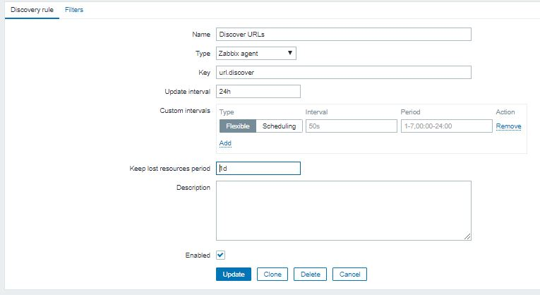
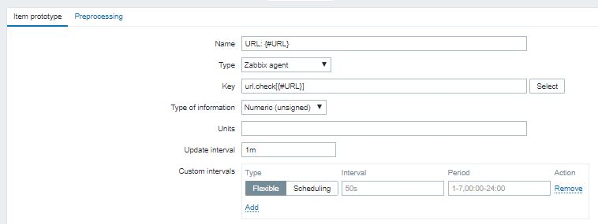
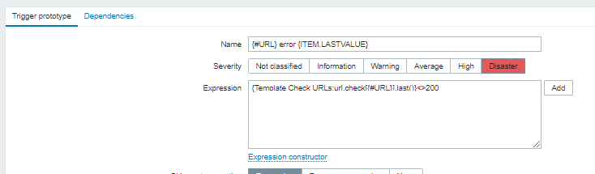

# CURLZabbix
Zabbix Discovery and Template to check HTTP code on dynamic list of URLs (or other stuff ;)

## Part I : the OS

### 1 - Dynamic list of URLs


``` bash
cat /etc/zabbix/url_list.txt

cas-bcra.gde.com
cas-uba.gde.com
cas-municipio.gde.com
```


### 2 - Script

__Discovery bash script__ will return JSON object with URLs in the txt.


``` bash
cat /url_discovery.sh

#!/bin/bash

declare -a urls
readarray -t urls < /etc/zabbix/url_list.txt

q=${#urls[@]}

echo "{"
echo "\"data\":["
for ((i=0;i<$q;i++));
    do
        if (( i < $q-1 )); then
            echo  "    {\"{#URL}\":\"${urls[i]}\"},"
        fi
        if (( i == $q-1 )); then
            echo  "    {\"{#URL}\":\"${urls[i]}\"}"
        fi
    done
echo "]"
echo "}"
```


### 3 - Put in crontab

``` bash
0 23 * * * /url_discovery.sh > /tmp/url_discovery.json
```

### 3 - Zabbix Agent

Add UserParameters, then restart it

``` bash
UserParameter=url.discover, cat /tmp/url_discovery.json
UserParameter=url.check[*], /url_check.sh $1
```

Then from zabbix server/proxy you can do

``` bash
$ zabbix_get -s 172.27.77.115 -k url.discover
{
"data":[
    {"{#HOST}":"cas-bcra.gde.com"},
    {"{#HOST}":"cas-uba.gde.com"},
    {"{#HOST}":"cas-municipio.gde.com"}
]
}


$ zabbix_get -s 172.27.77.115 -k url.check[cas-bcra.gde.com]
200

```

## Part II : the frontend

### Create a Template then __Create discovery rule__



### __Create item prototypes__ for urls



### __Create trigger prototypes__




Done. Apply to hosts, wait until discovery runs.


__Tip:__ You can use the same logic to monitor dynamically other stuff.


Enjoy!


